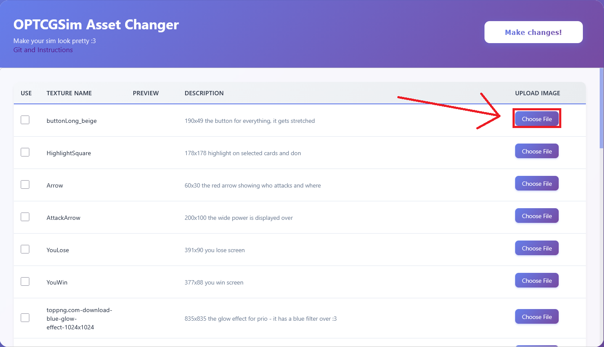
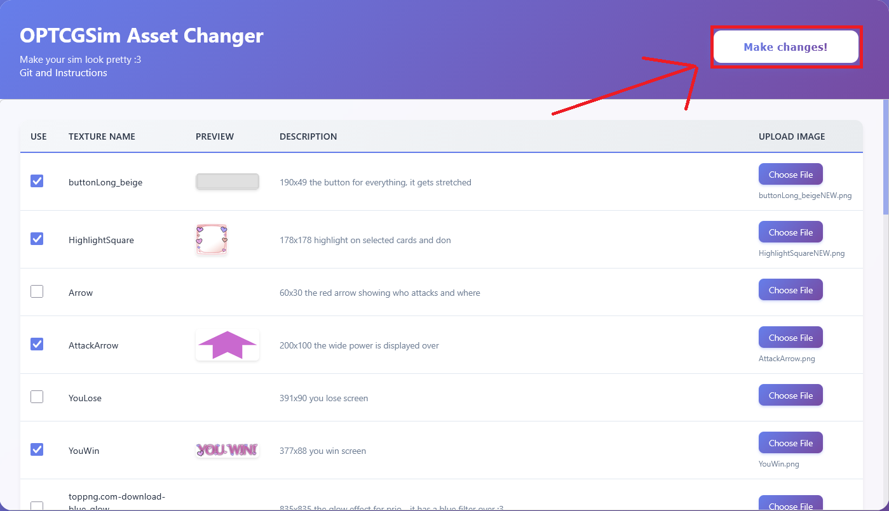
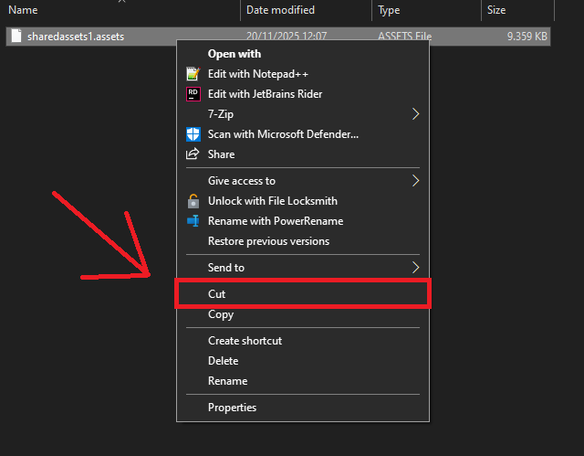
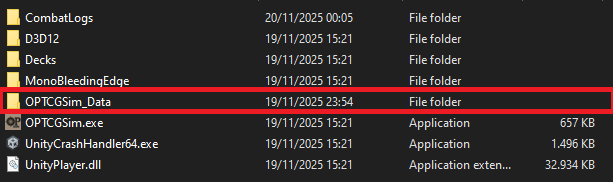
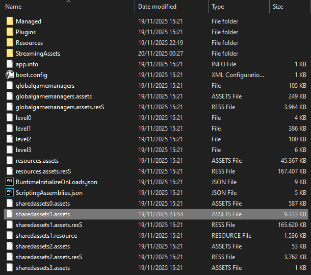
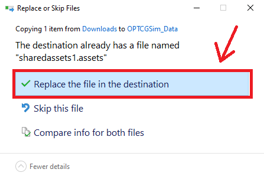

# Instructions
[Link to Website](https://maksmaksmaksmaksmaks.github.io/OPTCG-Asset-Changer-Web/)<br>
[Link to Assets](https://github.com/maksmaksmaksmaksmaks/OPTCG-Asset-Changer-Web/releases/tag/Assets-1.0)
## Pick the images you want to use

## Make changes
This will download a new ```sharedassets1.assets``` file that you need to place into your sim folder

## Find the file
Right click on the downloaded file and select "Cut"<br>


## Navigate to the sim folder
You want to find ```1.34b_Windows\Builds_Windows\OPTCGSim_Data``` folder<br>
Next to your ```OPTCGSim.exe```<br>
<br>
It should look like this<br>
<br>
Here you right-click and select "Paste"<br>
<br>
Replace the existing one<br>


## Now just run the sim :3
First load after changes can take a little longer

If you run into any issues feel free to text me on discord (praprotnikova4)

## Link to old version
[You can find the desktop version here!](https://github.com/maksmaksmaksmaksmaks/OPTCG-Asset-Changer)
